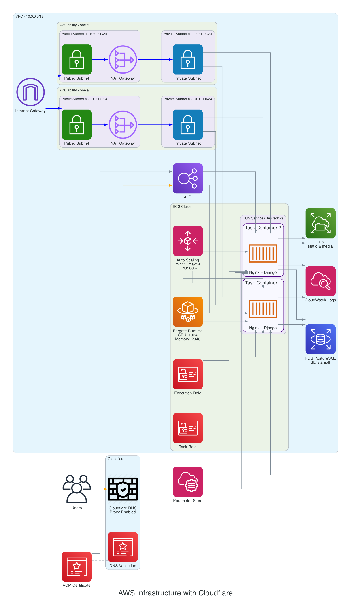

# Django Template with AWS Infrastructure

## Overview

This project is a Dockerized Django application integrated with AWS infrastructure managed via Terraform. It includes configurations for development, staging, and production environments, utilizing Docker Compose for container orchestration and Nginx for serving the application. The project structure is organized to streamline development, deployment, and maintenance processes.



## Features

- **Django Framework**: Robust web framework for rapid development.
- **Docker & Docker Compose**: Containerization for consistent environments across development, staging, and production.
- **Terraform**: Infrastructure as Code (IaC) for managing AWS resources.
- **AWS Integration**: Utilizes AWS services such as ECS, ECR, CloudWatch, and more.
- **Nginx**: Efficiently serves the Django application with optimized configurations.
- **Makefile Automation**: Simplifies common tasks and commands for ease of use.

## Directory Structure
- **app/**: Contains the Django application code and related Docker configuration.
- **infra/**: Holds Terraform configurations for managing AWS infrastructure.
- **nginx/**: Configuration and Docker setup for Nginx.
- **logs/**: Log files generated during development and deployment.
- **compose.\*.yml**: Docker Compose files for different environments (development, staging, production).
- **Makefile**: Automates common tasks and commands.

## Getting Started

### Prerequisites

Ensure you have the following installed:

- [Docker](https://www.docker.com/get-started)
- [Docker Compose](https://docs.docker.com/compose/install/)
- [Make](https://www.gnu.org/software/make/)
- [AWS CLI](https://aws.amazon.com/cli/)
- [Terraform](https://www.terraform.io/downloads.html)

### Installation

1. **Clone the Repository**

   ```bash
   git clone https://github.com/r74tech/django-template-aws.git
   cd django-template-aws
   ```

2. **Copy Environment Files**

   Use the Makefile to copy sample environment files:

   ```bash
   make copy-env
   ```

   This will create `.env.dev`, `.env.stg`, and `.env.prd` from their respective sample files if they do not already exist.

3. **Initialize the Project**

   Run the initialization process to build, migrate the database, collect static files, and create a superuser:

   ```bash
   make init
   ```

## Usage

The Makefile provides a variety of commands to manage the project. Below are some of the key targets:

### Development

- **Start Development Servers**

  ```bash
  make dev
  ```

  This command uses `compose.dev.yml` to start the development environment.

- **View Logs**

  ```bash
  make logs
  ```

- **Access Django Shell**

  ```bash
  make shell
  ```

### Staging

- **Start Staging Servers**

  ```bash
  make stg
  ```

  Uses `compose.stg.yml` to start the staging environment.

### Production

- **Start Production Servers**

  ```bash
  make prd
  ```

  Uses `compose.prd.yml` to start the production environment.

### Docker Commands

- **Build or Rebuild Services**

  ```bash
  make build
  ```

- **Stop All Services**

  ```bash
  make down
  ```

- **Show Status of Services**

  ```bash
  make status
  ```

### Database Commands

- **Run Migrations**

  ```bash
  make migrate
  ```

- **Access Database Shell**

  ```bash
  make db-shell
  ```

- **Flush Database**

  ```bash
  make db-flush
  ```

### AWS and Terraform

- **Login to AWS ECR**

  ```bash
  make aws-login
  ```

- **Run Terraform Plan**

  ```bash
  make tf-plan
  ```

- **Apply Terraform Changes**

  ```bash
  make tf-apply
  ```

- **Destroy Terraform Resources**

  ```bash
  make tf-destroy
  ```

- **Initialize Terraform**

  ```bash
  make tf-init
  ```

### Other Commands

- **Collect Static Files**

  ```bash
  make collectstatic
  ```

- **Create a Superuser**

  ```bash
  make createsuperuser
  ```

- **Create a New Django App**

  ```bash
  make app-create name=yourappname
  ```

- **Clean Up Docker Resources**

  ```bash
  make prune
  ```

## Makefile Targets

Below is a summary of available Makefile targets:

| Target        | Description                                   |
| ------------- | --------------------------------------------- |
| `init`        | Initialize project setup                      |
| `copy-env`    | Copy environment sample files                 |
| `dev`         | Start development servers                     |
| `stg`         | Start staging servers                         |
| `prd`         | Start production servers                      |
| `build`       | Build or rebuild Docker services              |
| `down`        | Stop all Docker services                      |
| `status`      | Show status of Docker services                |
| `logs`        | View logs from all services                   |
| `logs-app`    | View logs from the Django application         |
| `migrate`     | Run database migrations                       |
| `db-shell`    | Access the database shell                     |
| `db-makemigrations` | Generate database migrations          |
| `db-migrate`  | Apply database migrations                     |
| `db-flush`    | Flush the database                            |
| `collectstatic` | Collect static files                       |
| `createsuperuser` | Create a Django superuser              |
| `app-create`  | Create a new Django app                       |
| `shell`       | Access the Django shell                       |
| `prune`       | Clean up unused Docker resources              |
| `resetdb`     | Reset the database (WARNING: destroys data)    |
| `help`        | Show help message                             |
| `check-env`   | Check AWS environment variables               |
| `aws-login`   | Login to AWS ECR                              |
| `aws-vault`   | Start AWS Vault session                       |
| `aws-build`   | Build and push Docker images to ECR            |
| `tf-plan`     | Run Terraform plan                            |
| `tf-apply`    | Apply Terraform changes                       |
| `tf-destroy`  | Destroy Terraform resources                   |
| `tf-shell`    | Access Terraform shell                        |
| `tf-init`     | Initialize Terraform                           |

Run `make help` to see all available targets with descriptions.

## Contributing

Contributions are welcome! Please follow these steps:

1. Fork the repository.
2. Create a new branch for your feature or bugfix.
3. Commit your changes with clear and descriptive messages.
4. Push to your forked repository.
5. Create a pull request detailing your changes.

## License

This project is licensed under the [LICENSE](./LICENSE) file.